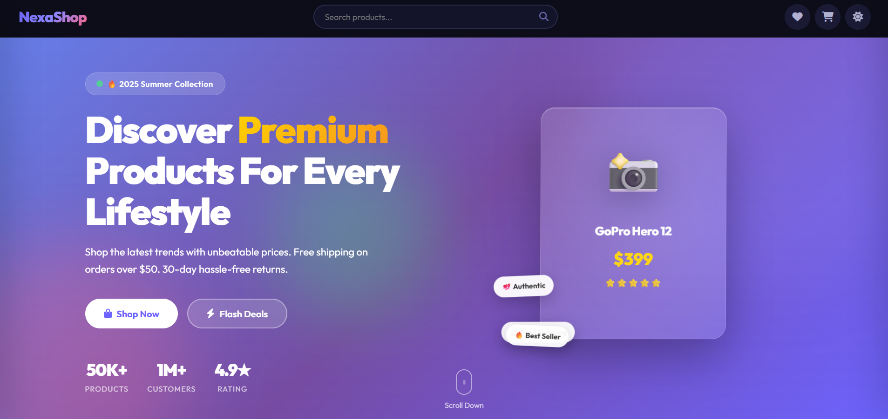

# 🛍️ NexaShop — Premium E-Commerce Store

> A modern, responsive and interactive e-commerce store built from scratch using **HTML, CSS and JavaScript**.

NexaShop is a feature-rich front-end e-commerce project designed to provide a smooth and engaging online shopping experience. It includes product discovery, filtering, sorting, wishlist management, shopping cart functionality, product details, theme switching, flash deals, and an interactive checkout interface.

The project focuses on **responsive UI design, interactive JavaScript functionality, state persistence and modern web development practices**.

---

## 🌐 Live Demo

🚀 **Live Demo:** *Add your GitHub Pages link here*

📂 **GitHub Repository:** *Add your repository link here*

---

## 📸 Preview


---

## ✨ Features

### 🛒 Shopping Experience

* Browse a collection of products
* View detailed product information
* Add products to the shopping cart
* Increase or decrease product quantities
* Remove products from the cart
* Calculate cart totals dynamically
* Add and remove products from the wishlist
* Persistent cart and wishlist data using `localStorage`

### 🔎 Product Discovery

* Search products by name and information
* Filter products by category
* Filter products by price range
* Filter products by rating
* Sort products by:

  * Featured
  * Price — Low to High
  * Price — High to Low
  * Rating
  * Newest

### ⚡ Interactive Features

* Flash Deals section with countdown timer
* Product detail modal
* Interactive ratings and reviews
* Toast notifications
* Newsletter subscription interface
* Interactive checkout interface
* Responsive mobile navigation
* Loading/preloader animation

### 🎨 UI & Design

* Modern e-commerce interface
* Fully responsive layout
* Light/Dark theme support
* Smooth transitions and animations
* Interactive hover effects
* Responsive product cards
* Modern typography
* Font Awesome icons

### 💾 Data Persistence

The project uses browser storage to preserve selected user preferences and shopping data:

* `localStorage` — Cart, wishlist and theme preference
* `sessionStorage` — Flash deal countdown state

---

## 🧑‍💻 Tech Stack

| Technology            | Usage                                             |
| --------------------- | ------------------------------------------------- |
| **HTML5**             | Website structure and semantic markup             |
| **CSS3**              | Layout, styling, animations and responsive design |
| **JavaScript (ES6+)** | Application logic and interactivity               |
| **Font Awesome**      | Icons                                             |
| **Google Fonts**      | Custom typography                                 |
| **Web Storage API**   | Cart, wishlist and theme persistence              |

---

## 📁 Project Structure

```text
NexaShop/
│
├── index.html              # Main HTML page
│
├── css/
│   └── style.css           # Complete website styling
│
├── js/
│   └── script.js           # Application logic and interactions
│
├── images/
│   └── preview.png         # Project preview image
│
└── README.md               # Project documentation
```

---

## 🚀 Getting Started

### 1. Clone the Repository

```bash
git clone https://github.com/ghareomkarr88/YOUR-REPOSITORY-NAME.git
```

### 2. Navigate to the Project

```bash
cd YOUR-REPOSITORY-NAME
```

### 3. Open the Project

You can simply open:

```text
index.html
```

in your browser.

For the best development experience, you can also use **Visual Studio Code with the Live Server extension**.

---

## 💡 How It Works

### Product Search & Filtering

Users can search for products and narrow the product catalogue using category, price and rating filters.

### Shopping Cart

Products can be added to the cart, where users can manage quantities and view dynamically calculated totals.

### Wishlist

Users can save products to their wishlist for later access.

### Persistent State

Cart, wishlist and theme preferences are stored in the browser using the **Web Storage API**, allowing the data to remain available after refreshing the page.

### Theme Switching

The interface supports both **Light Mode** and **Dark Mode**, with the selected preference saved locally.

### Flash Deals

The Flash Deals section includes a dynamic countdown timer to create a time-sensitive shopping experience.

---

## 📱 Responsive Design

NexaShop is designed to work across different screen sizes, including:

* 🖥️ Desktop
* 💻 Laptop
* 📱 Mobile
* 📟 Tablet

The layout, navigation, product grid and interactive components adapt to smaller screens for a better mobile experience.

---

## 🎯 Project Goals

This project was developed to practice and demonstrate:

* Front-end web development
* Responsive UI/UX design
* DOM manipulation
* JavaScript event handling
* Array methods and data filtering
* State management using browser storage
* Dynamic rendering of products
* Modal and interactive component development
* Modern CSS layouts and animations
* Building a complete front-end e-commerce experience

---

## 🔮 Future Improvements

Potential improvements for future versions include:

* [ ] Backend integration
* [ ] Real product database
* [ ] User authentication
* [ ] Real payment gateway integration
* [ ] Order management system
* [ ] Admin dashboard
* [ ] Product reviews stored in a database
* [ ] Server-side search and filtering
* [x] API-based product data
* [ ] User accounts and order history

---

## ⚠️ Disclaimer

NexaShop is a **front-end demonstration project** created for learning and portfolio purposes.

The checkout interface does not process real payments, and the product catalogue uses demonstration data. No real transactions are performed through this project.

---

## 📚 Learning Highlights

Building NexaShop provided practical experience with:

```text
HTML5
   ↓
Semantic Structure
   ↓
CSS3
   ↓
Responsive UI + Animations
   ↓
JavaScript
   ↓
DOM Manipulation + Events
   ↓
Product Filtering & Sorting
   ↓
Cart + Wishlist State
   ↓
localStorage / sessionStorage
   ↓
Interactive E-Commerce Experience
```

---

## 👨‍💻 Author

**Omkar R. Ghare**

Frontend Developer | Web Development Enthusiast

### Connect With Me

* 💻 GitHub: [@ghareomkarr88](https://github.com/ghareomkarr88)
* 📸 Instagram: [@ogcoderworld](https://instagram.com/ogcoderworld)
* ▶️ YouTube: [@ghareomkarr88](https://youtube.com/@ghareomkarr88)
* 📌 Pinterest: [@ghareomkarr88](https://in.pinterest.com/ghareomkarr88/)

---

## ⭐ Show Your Support

If you found this project interesting or useful, consider giving the repository a ⭐ on GitHub!

---

### 📄 License

This project is available for educational and portfolio purposes. See the repository for licensing details.
